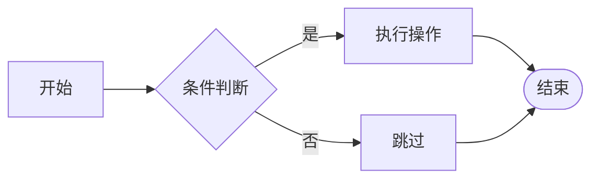
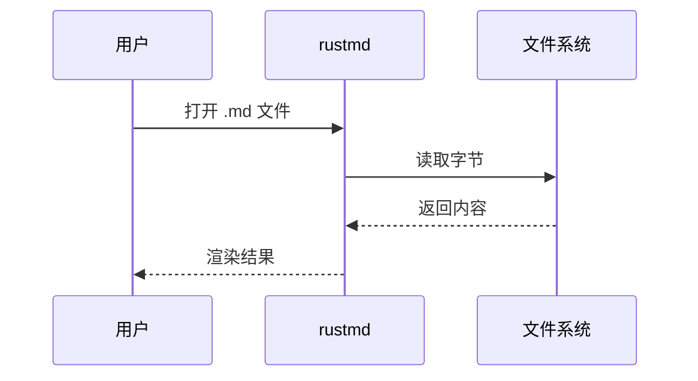
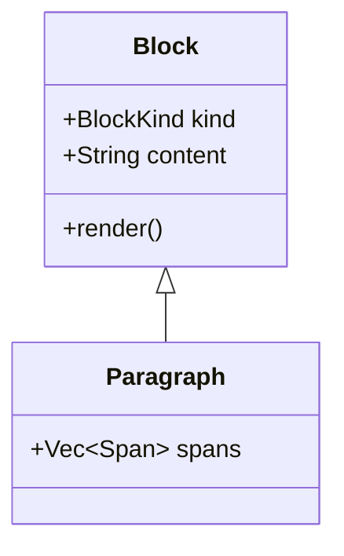
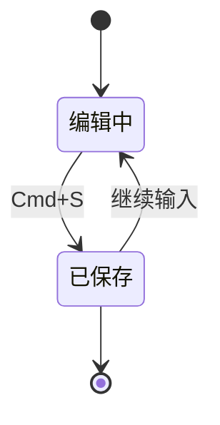
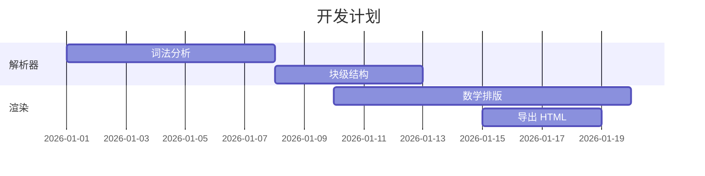
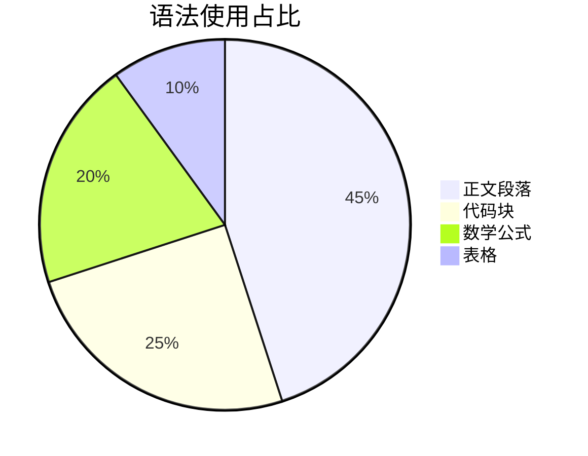
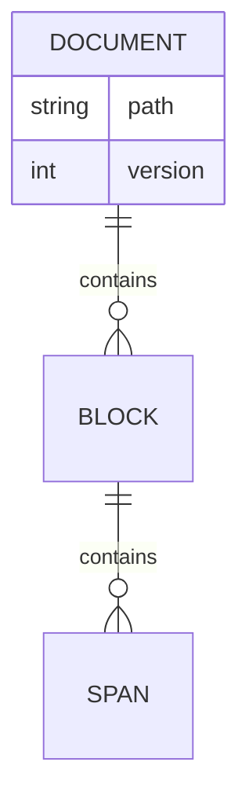
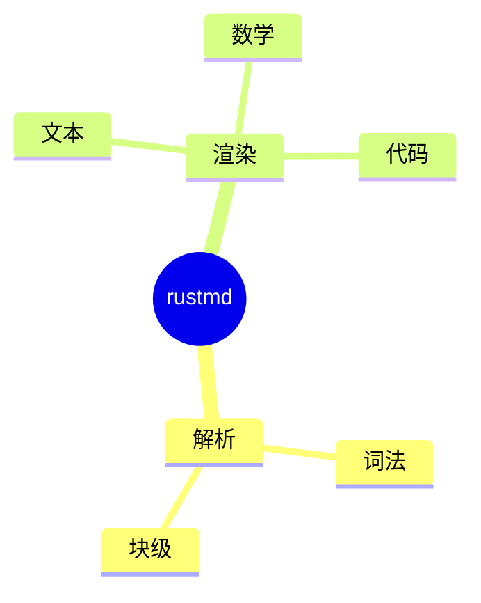
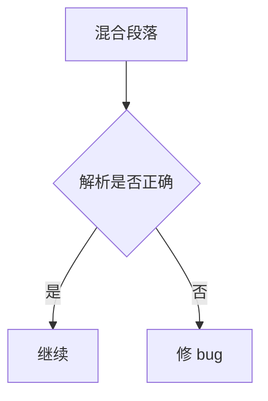

# rustmd 渲染压测文档

> 用途：一次性暴露 **Mermaid / LaTeX / 原始 HTML** 三类扩展语法的渲染行为。
> 用法：直接用 rustmd 打开本文件，逐节对照下面的「预期」看实际表现。
>
> 结论速览（基于当前源码）：三类语法都有自研渲染，不依赖 WebView 或 JS。
>
> - **LaTeX**：自研排版引擎，行内 `$...$` 与行间 `$$...$$` 均渲染。
> - **Mermaid**：自研引擎，八种图型可渲染（流程图/时序图/类图/状态图/甘特图/饼图/ER 图/思维导图），不认识的图型退回代码块。
> - **HTML**：块级标签（`div` / `table` / `details` / `ul` / `pre` / `img` …）按结构渲染，支持 `padding` `margin` `border` `background` `color` `width` `text-align` 这一小撮内联 CSS；行内标签只生效、不显示；看不懂的标签仍按行内代码显示（宁可留着也不吞字）。没有 CSS 引擎，未列出的属性会被忽略。

---

## 一、Mermaid

### 1.1 流程图 flowchart

**预期**：若已支持 → 出现带箭头、菱形判断框的矢量图；若未支持 → 显示为代码块，源码中的 `-->`、`{}` 应保留原文。关注点：代码块是否仍能被语法高亮，以及「光标移入该块显示源码」的交互是否照常工作。

### 1.2 时序图 sequenceDiagram

**预期**：同上。注意参与者别名 `as` 与虚线箭头 `-->>`。

### 1.3 类图 classDiagram

### 1.4 状态图 stateDiagram-v2

### 1.5 甘特图 gantt

### 1.6 饼图 pie

### 1.7 实体关系图 erDiagram

### 1.8 缩进敏感：mindmap

**缩进敏感型图**是额外的压力点：即使 Mermaid 被当作纯文本处理，行首空格也不该被折叠成代码块之外的缩进列表。

---

## 二、LaTeX

### 2.1 行内公式

最经典的 行内公式 $E = mc^2$ 应当与正文基线对齐，不独占一行。再来几个：$\alpha + \beta = \gamma$、$a^2 + b^2 = c^2$、$x_{i,j}^{(t)}$、$\frac{1}{2}$、$\sqrt{2} \approx 1.414$、$p(x) \in [0,1]$。

**预期**：行内公式高度不撑破行距，上下标尺寸递减，希腊字母正常显示。

### 2.2 行间公式：基础

$$
\sum_{i=1}^{n} x_i = \frac{n(n+1)}{2}
$$

$$
\int_{0}^{\infty} e^{-x^2}\,dx = \frac{\sqrt{\pi}}{2}
$$

$$
\lim_{x \to 0} \frac{\sin x}{x} = 1
$$

$$
\left( \frac{a}{b} \right)^{2} \qquad \sqrt[3]{x + y} \qquad \binom{n}{k} = \frac{n!}{k!(n-k)!}
$$

### 2.3 行间公式：大算子

$$
\prod_{k=1}^{n} k = n! \qquad \bigcup_{i \in I} A_i \qquad \bigcap_{i \in I} A_i
$$

$$
\oint_{C} \mathbf{E} \cdot d\mathbf{l} = -\frac{d}{dt} \iint_{S} \mathbf{B} \cdot d\mathbf{S}
$$

**预期**：`\sum` `\prod` `\int` 在行间模式下，上/下限应位于符号**上下**方（而非右下/右上）；行内模式下则应压缩为角标。这是区分 display / inline 排版的关键用例。

### 2.4 矩阵

$$
\begin{pmatrix}
a & b \\
c & d
\end{pmatrix}
\begin{bmatrix}
1 & 0 \\
0 & 1
\end{bmatrix}
\begin{vmatrix}
x & y \\
z & w
\end{vmatrix}
$$

**预期**：括号类型应分别为圆括号、方括号、单竖线。注意：当前引擎对 `&` 仅插入固定间距而**不做列对齐**，所以各列是否对齐不作为判定通过的标准。

### 2.5 分段函数 cases

$$
f(x) =
\begin{cases}
x^2, & x \ge 0 \\
-x,  & x < 0
\end{cases}
$$

### 2.6 多行对齐 aligned

$$
\begin{aligned}
(a+b)^2 &= a^2 + 2ab + b^2 \\
(a-b)^2 &= a^2 - 2ab + b^2
\end{aligned}
$$

### 2.7 希腊字母与符号压力测试

$$
\alpha\ \beta\ \gamma\ \delta\ \epsilon\ \theta\ \lambda\ \mu\ \pi\ \sigma\ \phi\ \omega
$$

$$
\Gamma\ \Delta\ \Theta\ \Lambda\ \Pi\ \Sigma\ \Phi\ \Omega
$$

$$
\leq\ \geq\ \neq\ \approx\ \equiv\ \propto\ \pm\ \times\ \div\ \cdot\ \infty\ \partial\ \nabla
$$

$$
\in\ \notin\ \subset\ \subseteq\ \cup\ \cap\ \forall\ \exists\ \nexists\ \rightarrow\ \Rightarrow\ \leftrightarrow
$$

### 2.8 重音与字体

$$
\hat{a}\ \bar{b}\ \vec{v}\ \tilde{x}\ \dot{y}\ \ddot{z}\ \overline{AB}\ \underline{cd}
$$

$$
\mathbb{R}\ \mathcal{L}\ \mathrm{arctan}\ \mathbf{Bold}
$$

### 2.9 长公式（换行压力）

$$
\left( \sum_{k=1}^{n} a_k b_k \right)^2 \leq \left( \sum_{k=1}^{n} a_k^2 \right) \left( \sum_{k=1}^{n} b_k^2 \right)
$$

$$
\nabla \times \mathbf{B} = \mu_0 \left( \mathbf{J} + \varepsilon_0 \frac{\partial \mathbf{E}}{\partial t} \right)
$$

**预期**：行间公式应**水平居中**，且不因宽度超出而被裁切；若编辑器宽度很窄，观察是否溢出面板边界。

### 2.10 边界：未闭合的行内公式

这里有一个故意不闭合的美元符号：$a + b = c ，后面继续写正文。

以及转义的美元符号：\$100 与 \$200，不应被识别为公式。

**预期**：未闭合的 `$` 不应吞掉后续正文；`\$` 应显示字面量 `$`。

---

## 三、原始 HTML

### 3.1 块级 HTML：div + 内联样式

  <strong>块级 HTML：</strong>如果渲染器支持，这里应是一个带蓝色左边线和浅蓝底色的提示框。

**预期**：浅蓝底（`#f4f7fb`）+ 左侧 4px 蓝条（`#4c8bf5`）+ 12px 内边距的卡片，`<strong>` 显示为加粗；标签本身不可见。

### 3.2 块级 HTML：表格

<table>
  <thead>
    <tr><th>语法</th><th>实现方式</th><th>状态</th></tr>
  </thead>
  <tbody>
    <tr><td>标题</td><td>egui 富文本</td><td>完成</td></tr>
    <tr><td>数学</td><td>自研排版引擎</td><td>完成</td></tr>
    <tr><td>Mermaid</td><td>—</td><td>未支持</td></tr>
  </tbody>
</table>

**预期**：渲染成真正的表格——表头底色 + 每行一条分隔线，表头加粗；不是一行行标签。

### 3.3 块级 HTML：details / summary

  
点开查看折叠内容

  
这是一个原生折叠控件，用于测试交互型 HTML 标签。

**预期**：一行带三角箭头的 `
`，正文默认展开（阅读器不该把内容藏起来）；点箭头可折叠。

### 3.4 块级 HTML：图片与换行

 
这行文字使用 span 的 color 样式。

**预期**：图片按 `width="120"` 缩放（联网才加载，离线时是占位框），` ` 之后那句话换到下一行并且是砖红色 `#b7410e`。

### 3.5 行内 HTML

正文中使用行内标签：<b>粗体 b</b>、<i>斜体 i</i>、<u>下划线 u</u>、<code>code 标签</code>、红色 span，以及注释 <!-- 这是一段 HTML 注释 --> 和自闭合标签  。

自动链接也应生效：<https://www.rust-lang.org> 与 <mailto:hi@example.com>。

**预期**：行内标签**只生效、不显示**——`<b>` 加粗、`<i>` 斜体、`<u>` 下划线、`<code>` 等宽、`` 变红、` ` 换行、注释完全不可见（既看不到文字也不占位置）。`<https://...>` 这类自动链接应变成**可点击链接**，而不是被当作代码——这是判断行内 HTML 处理逻辑是否正确分支的关键点。

### 3.6 混合：HTML 标签内嵌 Markdown

  **这里的 Markdown 加粗还会生效吗？** 以及行内公式 $x^2$。

**预期**：淡黄底的块里，`**加粗**` 仍加粗、`$x^2$` 仍渲染成公式——HTML 块不应该把 Markdown 关掉。

### 3.7 混合：引用块 + HTML + 公式

> 引用块内嵌行内标签 <kbd>Cmd</kbd> + <kbd>S</kbd>，以及行内公式 $\pi r^2$。
>
> 
引用块里的块级 div。

**预期**：引用条正常，块级 div 在引用块内部渲染，文字用 `#666` 灰色。

### 3.8 块级 HTML：列表、pre 与不认识的标签

<ul>
  <li>无序项一</li>
  <li>无序项二</li>
</ul>

<pre>已经  格式化
    的文本</pre>

<widget>这个标签渲染器不认识。</widget>

**预期**：`<ul>` 出项目符号；`<pre>` 出等宽代码块且保留缩进；不认识的 `<widget>` **按行内代码显示出来**而不是被删掉——看不懂的标记宁可留着，也不能悄悄吞字。

## 四、交叉验证区

下面把三类语法塞进同一段落，检验区块划分是否互相干扰：

一段混合文本：行内公式 $a^2+b^2=c^2$ 加行内标签 <em>em 标签</em> 再加 `行内代码`，随后紧跟一个 mermaid 代码块。

| 类型 | 例子 | 当前状态 |
| --- | --- | --- |
| Mermaid | `flowchart LR` | 自研引擎成图 |
| LaTeX 行内 | `$E=mc^2$` | 自研引擎渲染 |
| LaTeX 行间 | `$$...$$` | 自研引擎渲染，居中独占一段 |
| 行内 HTML | `<b>bold</b>` | 只生效不显示；不认识的标签按行内代码显示 |
| 块级 HTML | `
...
` | 按结构渲染；无结构时退回普通段落 |

表格之后紧跟行间公式，检查块间距：

$$
e^{i\pi} + 1 = 0
$$

---

## 附：判定清单

- [ ] Mermaid 八种图：渲染成图而非代码块；光标进入该块时显示源码
- [ ] 行内公式与正文基线对齐，不撑破行高
- [ ] `\sum` `\int` 在行间模式下上下限位于符号正上/正下
- [ ] 矩阵括号类型（圆/方/竖线）正确
- [ ] 未闭合 `$` 与 `\$` 处理正确
- [ ] 块级 HTML 不导致后续内容错位
- [ ] `<https://...>` 自动链接可点击，未被当作代码
- [ ] 混合段落中三类语法互不吞并
- [ ] HTML 块级结构：卡片有底色+左条、表格成表、列表有符号、`<pre>` 保缩进
- [ ] HTML 行内标签不显示，注释不可见，不认识的标签仍可见
- [ ] HTML 块内的 Markdown（`**加粗**`、`$公式$`）仍然生效
